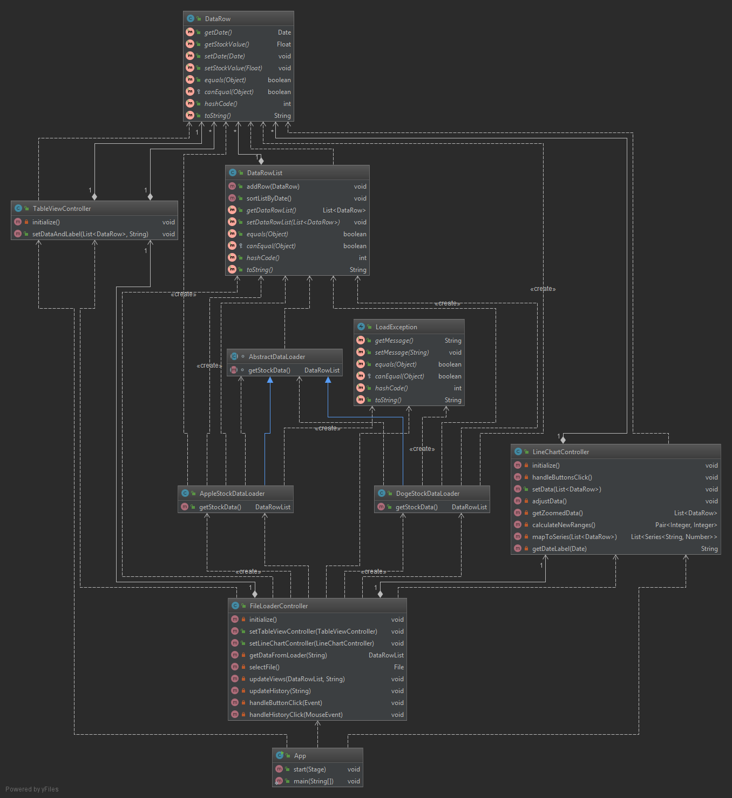

# Electron exiles
## Stock Winner - techologie obiektowe 2 

### Założenia projektowe:
#### Etap 1:
- Utworzenie prywatnego repozytorium na [Github](https://github.com/FrozenTear7/electron-exiles)
- Podstawowa funkcjonalność
- Testy podstawowej funkcjonalności

##### Schemat klas stanu obecnego

##### Podstawowa funkcjonalość
- Model danych akcji
- Wczytywanie danych z pliku .csv o konkretnych polach
- Przykładowe GUI z polem wczytania pliku, tabelą danych i wykresem liniowym
- Testy jednostkowe funkcji kontrolerów

GUI na stan etapu 1 składa się z okna wczytania pliku .csv, tabeli pokazującej datę i wartość
oraz wykres wizualizujący te dane.\
Utworzona została klasa abstrakcyjna po której dziedziczą klasy zajmujące się odczytem danych.\
Pozwala to na utworzenie standardu i połączenie plików z ich loaderami.
Wykres posiada podstawowe funkcje przybliżania i oddalania i poruszania się po zakresie czasowym.

#### Etap 2:
TO BE CONTINUED

#### Authors
- Filip Duczymiński
- Wojciech Klemens
- Konrad Grela
- Paweł Mendroch
