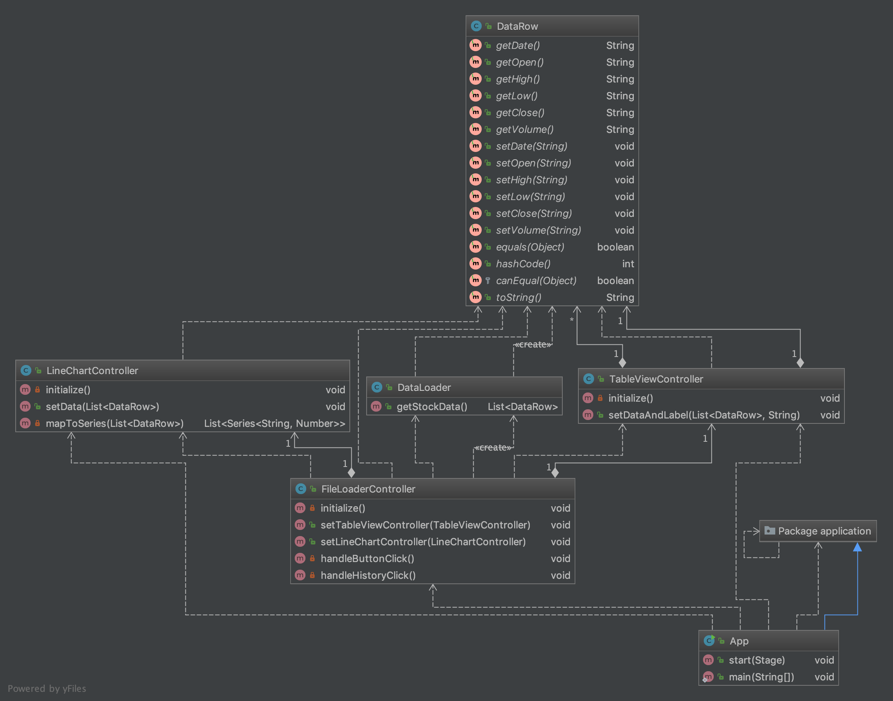

# Electron exiles
## Stock Winner - techologie obiektowe 2 

### Założenia projektowe:
#### Etap 1:
- Utworzenie prywatnego repozytorium na [Github](https://github.com/FrozenTear7/electron-exiles)
- Podstawowa funkcjonalność
- Testy podstawowej funkcjonalności

##### Schemat klas stanu obecnego

##### Podstawowa funkcjonalość
- Model danych akcji
- Wczytywanie danych z pliku .csv o konkretnych polach
- Przykładowe GUI z polem wczytania pliku, tabelą danych i wykresem liniowym
- Testy jednostkowe funkcji kontrolerów

##### TODO
- Stworzenie strategii na podstawie danych akcji
- Ulepszenie wyglądu GUI
- Przygotowanie większej ilości plików przykładowych
- Ustanowienie standardu danych .csv
- Większa ilość testów

#### Etap 2:
TO BE CONTINUED

#### Authors
- Filip Duczymiński
- Wojciech Klemens
- Konrad Grela
- Paweł Mendroch
